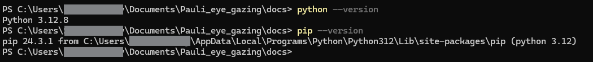

# Wiki Editing

## Python Installation
MkDocs is a python package, so first of all you need to instal [Python and pip](https://www.python.org/downloads/).

Confirm Python installation with the commands `python --version` and `pip --version`. If you see versions then everything is installed correctly

## MkDocs Installation
Now that you have pip, you can download MkDocs with the command `pip install mkdocs`. Confirm succesful installation by running `mkdocs --version` command. Like previously if you see the message with version, you are good to go. For additional reference you can use the [official page](https://www.mkdocs.org/user-guide/installation/#installing-mkdocs).

## Material for MkDocs Installation
We use Material Theme for MkDocs, you can install it buy running `pip install mkdocs-material` command. For additional reference you can use the [official page](https://squidfunk.github.io/mkdocs-material/getting-started/).

## Running the Weboage locally
Now you can run the webpage with the command `mkdocs serve` and see it locally by going to [localhost:8000](http://localhost:8000/) page.

!!! example
    Make sure to be in main repo folder in terminal

MkDocs includes live reloading server, if you see your changes, you can immediately see the results on the local page.

For additional reference you can use the [official page](https://squidfunk.github.io/mkdocs-material/creating-your-site/).

## Publishing
Website is automatically rebuild and deployed via GitHub pages on every new commit to master or main branch. Then it is accessible via github.io link.

Deployment logic is stored inside `./.github/workflows/ci.yml` file.

## Website Changes
If you want to change the look, you can go through [Setup](https://squidfunk.github.io/mkdocs-material/setup/) page of official wiki and play around with main mkdocs.yml file.

## Text Editing
See the main file structure inside mkdocs.yml file and edit any respective .md file.

For all available syntax, go to [Reference](https://squidfunk.github.io/mkdocs-material/reference/) page. They you can see all functionality of Material for MkDocs.

