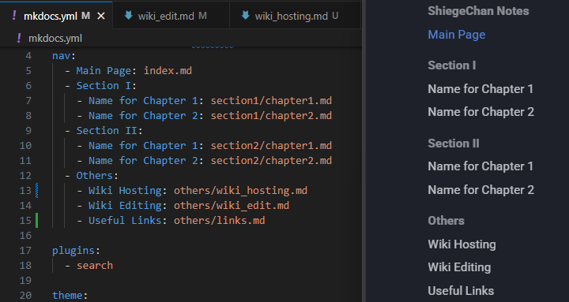

# Wiki Contents Editing
Locally hosted webpage is automatically reloaded reacting to every change you make, which makes any changes very easy to see. See previous page on how to open up the webpage.

## Website Appearance
To change website appearance you can edit `./mkdocs.yml` file. You can go through official wiki [Setup](https://squidfunk.github.io/mkdocs-material/setup/) page to find out all available tweaks.

## Navigation Structure
First of all you need to define main file structure inside `./mkdocs.yml` file. This way you define which markdown corresponds to which page, in which order are they placed and with which name they are displayed.

## Page Editing
Open the corresponding markdown `.md` file for the page you want to edit. Then you can write the text and use different command to create code blocks, annotations, links and other interractive stuff. 

!!! tip
    For all available syntax, go to official [Reference](https://squidfunk.github.io/mkdocs-material/reference/) page. They you can see all functionality of Material for MkDocs.

